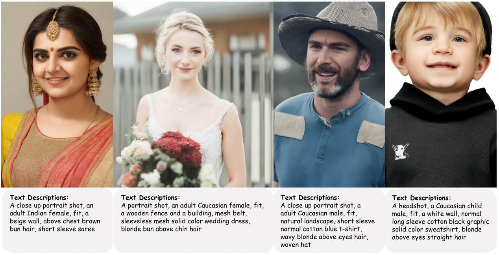

# CosmicMan: A Text-to-Image Foundation Model for Humans


[Shikai Li](mailto:lishikai@pjlab.org.cn), [Jianglin Fu](mailto:fujianglin@pjlab.org.cn), [Kaiyuan Liu](mailto:1154864382@mail.dlut.edu.cn), [Wentao Wang](mailto:wangwentao@pjlab.org.cn), [Kwan-Yee Lin](mailto:linjunyi9335@gmail.com), [Wayne Wu](mailto:wuwenyan0503@gmail.com) <br>
**[[Video Demo]](https://www.youtube.com/watch?v=CsZKA27tQDA)** | **[[Project Page]](https://cosmicman-cvpr2024.github.io/)** | **[[Paper]](https://arxiv.org/abs/2404.01294)** | **[[Huggingface Gradio]](https://huggingface.co/spaces/cosmicman/CosmicMan-SDXL)**  

**Abstract:** We present **CosmicMan**, a text-to-image foundation model specialized for generating high-fidelity human images. Unlike current general-purpose foundation models that are stuck in the dilemma of inferior quality and text-image misalignment for humans, CosmicMan enables generating photo-realistic human images with meticulous appearance, reasonable structure, and precise text-image alignment with detailed dense descriptions. <br>
At the heart of CosmicMan's success are the new reflections and perspectives on data and model: (1) We found that data quality and a scalable data production flow are essential for the final results from trained models. Hence, we propose a new data production paradigm, **Annotate Anyone**, which serves as a perpetual data flywheel to produce high-quality data with accurate yet cost-effective annotations over time. Based on this, we constructed a large-scale dataset **CosmicMan-HQ 1.0**, with 6 Million high-quality real-world human images in a mean resolution of 1488x1255, and attached with precise text annotations deriving from 115 Million attributes in diverse granularities. (2) We argue that a text-to-image foundation model specialized for humans must be pragmatic - easy to integrate into down-streaming tasks while effective in producing high-quality human images. Hence, we propose to model the relationship between dense text descriptions and image pixels in a decomposed manner, and present **D**ecomposed-**A**ttention-**R**efocus**ing** (**Daring**) training framework. It seamlessly decomposes the cross-attention features in existing text-to-image diffusion model, and enforces attention refocusing without adding extra modules. Through Daring, we show that explicitly discretizing continuous text space into several basic groups that align with human body structure is the key to tackling the misalignment problem in a breeze. <br>

## Updates
- [14/06/2024] Pretrained models [CosmicManHQ-SDXL](https://huggingface.co/cosmicman/CosmicMan-SDXL), [CosmicManHQ-SD](https://huggingface.co/cosmicman/CosmicMan-SD) and inference scripts are released. 
- [29/04/2024] [CosmicManHQ-1.0 Dataset](https://huggingface.co/datasets/cosmicman/CosmicManHQ-1.0) is released!
- [05/04/2024] :fire::fire::fire:CosmicMan is selected as **Highlight Paper** (324 out of 11,532 submissions) at CVPR 2024!
- [02/04/2024] [Technical report](https://arxiv.org/abs/2404.01294) has been released.
- [01/03/2024] CosmicMan has been accepted by CVPR2024.


## Usage
Our CosmicMan-SDXL is based on [stabilityai/stable-diffusion-xl-base-1.0](https://huggingface.co/stabilityai/stable-diffusion-xl-base-1.0) and UNet checkpoint for CosmicMan-SDXL can be download from huggingface page [cosmicman/CosmicMan-SDXL](https://huggingface.co/cosmicman/CosmicMan-SDXL). 
Our CosmicMan-SD is based on [runwayml/stable-diffusion-v1-5](https://huggingface.co/runwayml/stable-diffusion-v1-5) and UNet checkpoint for CosmicMan-SD can be download from huggingface page [cosmicman/CosmicMan-SD](https://huggingface.co/cosmicman/CosmicMan-SD). 


### Requirements
```
conda create -n cosmicman python=3.10
source activate cosmicman
pip install torch torchvision torchaudio --index-url https://download.pytorch.org/whl/cu118
pip install accelerate diffusers datasets transformers botocore invisible-watermark bitsandbytes gradio==3.48.0
```

### Quick start with [Gradio](https://www.gradio.app/guides/quickstart)

To get started, first install the required dependencies, then run:

```
cd ./scripts
# CosmicMan-SDXL 
python demo_sdxl.py
```
Let's have a look at a simple example using the `http://your-server-ip:port`.


### Inference

You can directly use our model with Diffusers for CosmicMan-SDXL and CosmicMan-SD:

```
# CosmicMan-SDXL 
import torch
from diffusers import StableDiffusionXLPipeline, StableDiffusionXLImg2ImgPipeline, UNet2DConditionModel, EulerDiscreteScheduler
from huggingface_hub import hf_hub_download
from safetensors.torch import load_file

base_path = "stabilityai/stable-diffusion-xl-base-1.0"
refiner_path = "stabilityai/stable-diffusion-xl-refiner-1.0"
unet_path = "cosmicman/CosmicMan-SDXL"

# Load model.
unet = UNet2DConditionModel.from_pretrained(unet_path, torch_dtype=torch.float16)
pipe = StableDiffusionXLPipeline.from_pretrained(base_path, unet=unet, torch_dtype=torch.float16, variant="fp16", use_safetensors=True).to("cuda")
pipe.scheduler = EulerDiscreteScheduler.from_pretrained(base_path, subfolder="scheduler", torch_dtype=torch.float16)

refiner = StableDiffusionXLImg2ImgPipeline.from_pretrained(refiner_path, torch_dtype=torch.float16, variant="fp16", use_safetensors=True).to("cuda") # we found use base_path instead of refiner_path may get a better performance

# Generate image.
positive_prompt = "A fit Caucasian elderly woman, her wavy white hair above shoulders, wears a pink floral cotton long-sleeve shirt and a cotton hat against a natural landscape in an upper body shot"
negative_prompt = ""
image = pipe(positive_prompt, num_inference_steps=30, 
        guidance_scale=7.5, height=1024, 
        width=1024, negative_prompt=negative_prompt, output_type="latent").images[0]
image = refiner(positive_prompt, negative_prompt=negative_prompt, image=image[None, :]).images[0].save("output.png")
```

```
# CosmicMan-SD
import torch
from diffusers import StableDiffusionPipeline, UNet2DConditionModel, EulerDiscreteScheduler
from huggingface_hub import hf_hub_download
from safetensors.torch import load_file

base_path = "runwayml/stable-diffusion-v1-5"
unet_path = "cosmicman/CosmicMan-SD"

# Load model.
unet = UNet2DConditionModel.from_pretrained(unet_path, torch_dtype=torch.float16)
pipe = StableDiffusionPipeline.from_pretrained(base_path, unet=unet, torch_dtype=torch.float16, variant="fp16").to("cuda")
pipe.scheduler = EulerDiscreteScheduler.from_pretrained(base_path, subfolder="scheduler", torch_dtype=torch.float16)

# Generate image.
positive_prompt = "A closeup portrait shot against a white wall, a fit Caucasian adult female with wavy blonde hair falling above her chest wears a short sleeve silk floral dress and a floral silk normal short sleeve white blouse"
negative_prompt = ""
image = pipe(positive_prompt, num_inference_steps=30, 
        guidance_scale=7.5, height=1024, 
        width=1024, negative_prompt=negative_prompt, output_type="pil").images[0].save("output.png")
```

We also provide the inference scripts in this repository for CosmicMan-SDXL and CosmicMan-SD:

```
cd ./scripts
# CosmicMan-SDXL 
python infer_sdxl.py --H 1024 --W 1024 --outdir ./Output_sdxl  --steps 30 --use_refiner \
    --prompts "A fit Caucasian elderly woman, her wavy white hair above shoulders, wears a pink floral cotton long-sleeve shirt and a cotton hat against a natural landscape in an upper body shot"\

# CosmicMan-SD
python infer_sd.py --H 1024 --W 1024  --outdir ./Output_sd  --steps 30 \
    --prompts "A closeup portrait shot against a white wall, a fit Caucasian adult female with wavy blonde hair falling above her chest wears a short sleeve silk floral dress and a floral silk normal short sleeve white blouse" \
```


## TODOs
- [x] Release technical report.
- [x] Release data.
- [x] Release Inference code.
- [x] Release pretrained models.
- [ ] Release training code.


## Related Work
* (ECCV 2022) **StyleGAN-Human: A Data-Centric Odyssey of Human Generation**, Jianglin Fu et al. [[Paper](https://arxiv.org/pdf/2204.11823.pdf)], [[Project Page](https://stylegan-human.github.io/)], [[Dataset](https://github.com/stylegan-human/StyleGAN-Human)]
* (ICCV 2023) **UnitedHuman: Harnessing Multi-Source Data for High-Resolution Human Generation**, Jianglin Fu et al. [[Paper](https://arxiv.org/abs/2309.14335)], [[Project Page](https://unitedhuman.github.io/)]

## Citation

If you find this work useful for your research, please consider citing our paper:

```bibtex
@inproceedings{cosmicman,
      title = {CosmicMan: A Text-to-Image Foundation Model for Humans},
      author = {Li, Shikai and Fu, Jianglin and Liu, Kaiyuan and Wang, Wentao and Lin, Kwan-Yee and Wu, Wayne},
      booktitle = {Computer Vision and Pattern Recognition (CVPR)},
      year = {2024}
}
```


